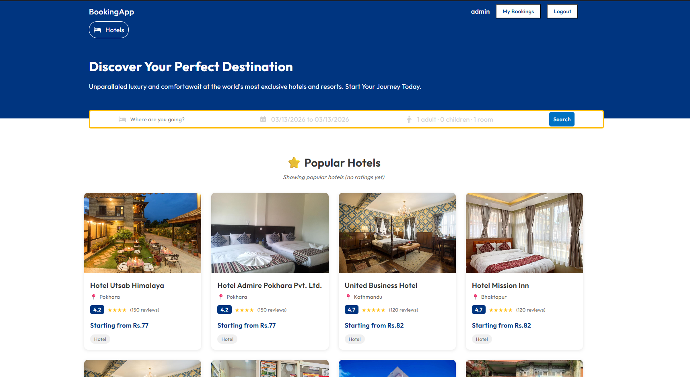
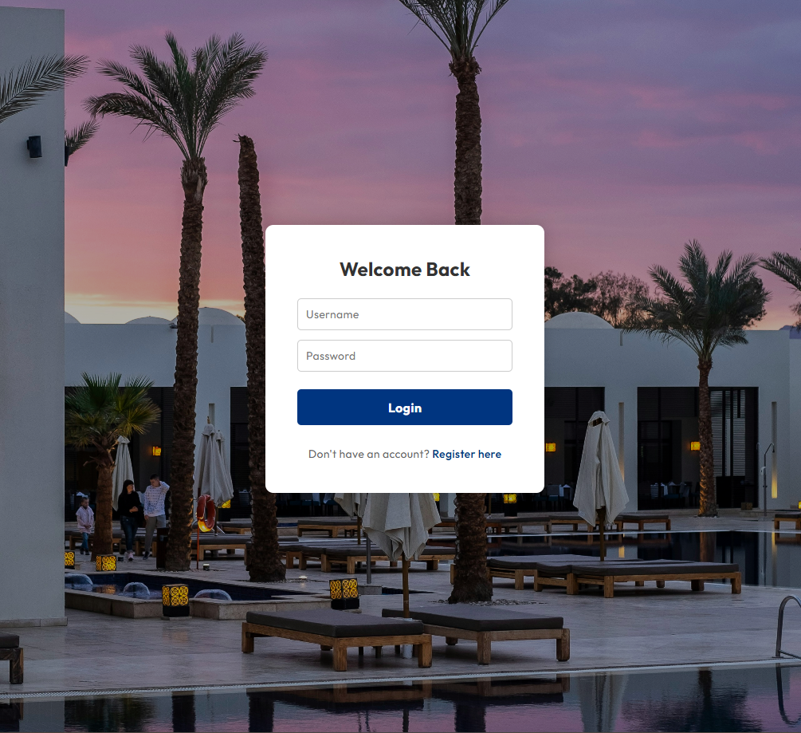
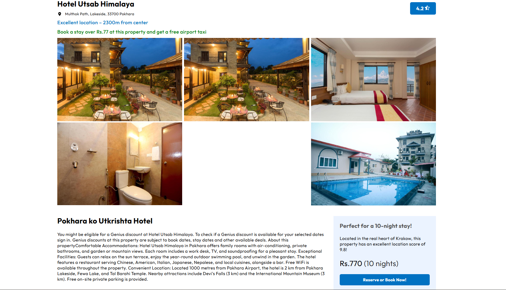
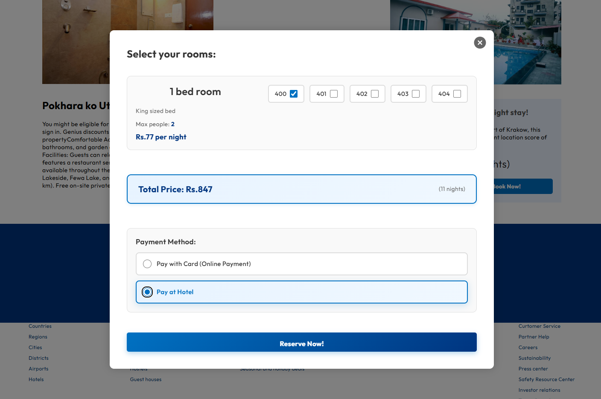
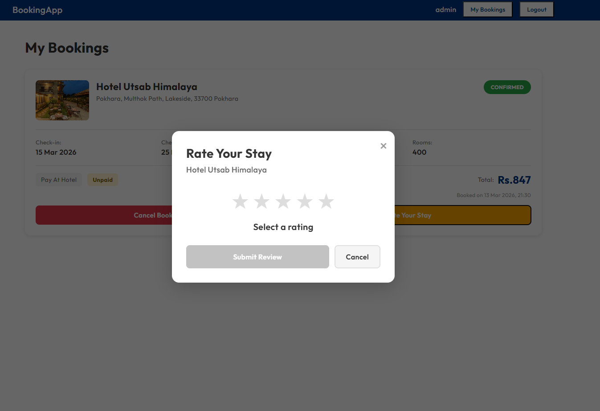
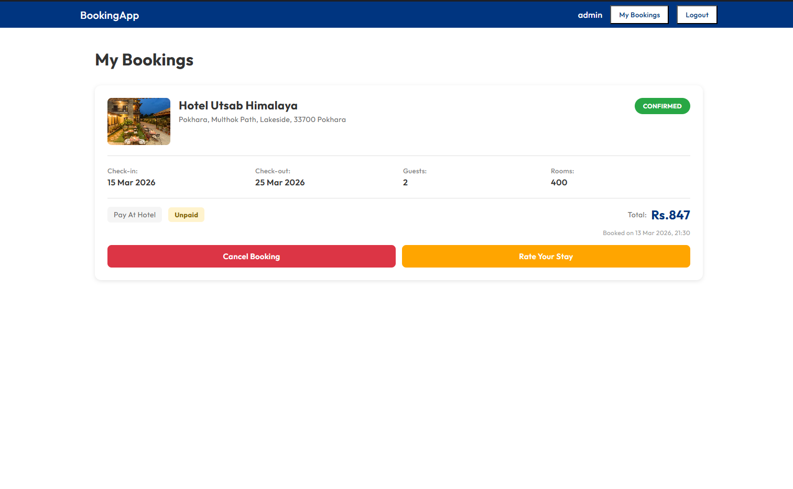
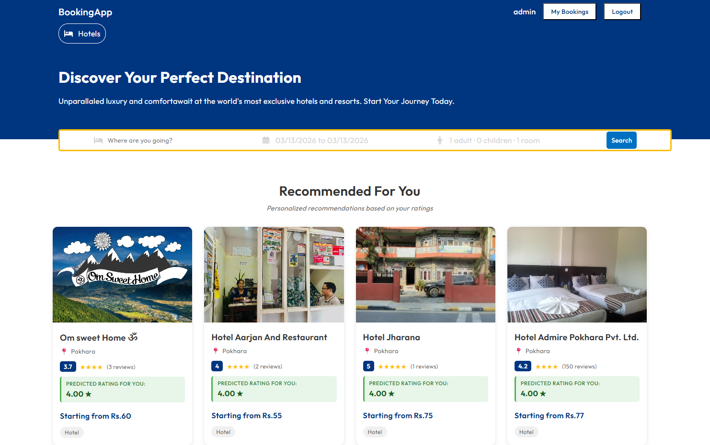

# Hotel Booking App

A full-stack hotel booking platform that allows users to search hotels, book rooms, make payments, and manage bookings. It also includes an admin dashboard for managing users, hotels, rooms, and bookings. The project is built with the MERN stack and integrates Stripe payments, email verification, and a <ins>recommendation engine</ins>.

## Project Structure

```
hotel-booking/
├── api/        # Node.js + Express REST API
├── client/     # React customer frontend
└── admin/      # React admin dashboard
```

---

## Documentation

| Folder    | README                                 |
| --------- | -------------------------------------- |
| 📡 API    | [api/README.md](./api/Readme.md)       |
| 🌐 Client | [client/README.md](./client/README.md) |
| 🛠️ Admin  | [admin/README.md](./admin/README.md)   |

---

## Features

**Customer (client)**

- Search hotels by city, date, guests, and price range
- View hotel details with photo gallery
- Reserve rooms and pay via Stripe
- Email verification on registration
- Manage and cancel bookings
- Personalized hotel recommendations

**Admin (admin)**

- Dashboard with live stats, revenue charts, and recent transactions
- Full CRUD for users, hotels, and rooms
- Bookings management with status updates
- Dark mode support

**API**

- JWT authentication with email verification
- Stripe payment intents, confirmations, webhooks, and refunds
- Collaborative filtering recommendation engine (Pearson Correlation)
- Revenue analytics

---

## Tech Stack

| Layer    | Technologies                            |
| -------- | --------------------------------------- |
| Frontend | React 19, Vite, React Router v7         |
| Admin    | React 19, Vite, MUI v7, Recharts        |
| Backend  | Node.js, Express 5, MongoDB, Mongoose 8 |
| Auth     | JWT, bcryptjs                           |
| Payments | Stripe                                  |
| Email    | Nodemailer (Gmail SMTP)                 |

---

## Quick Start

Make sure MongoDB and the API are running before starting the client or admin.

```bash
# 1. Start the API (port 8800)
cd api && npm install && npm start

# 2. Start the client (port 5173)
cd client && npm install && npm run dev

# 3. Start the admin (port 5173 — run separately)
cd admin && npm install && npm run dev
```

> See each folder's README for full setup instructions and environment variables.

---

## Client Screenshots

| Home Page                                    | Login                                     |
| -------------------------------------------- | ----------------------------------------- |
|  |  |

| Single Hotel                                     | Reserve                                      |
| ------------------------------------------------ | -------------------------------------------- |
|  |  |

| Rating                                      | My Bookings                                        |
| ------------------------------------------- | -------------------------------------------------- |
|  |  |

| Personalized Recommendations After Booking & Rating                 |
| ------------------------------------------------------------------- |
|  |

---
